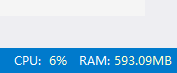

# Status Info

Display CPU usage and the memory usage of the current instance of Visual Studio in the status bar.

Install [StatusInfo](https://marketplace.visualstudio.com/items?itemName=lkytal.StatusInfo) via VS market

## Screenshot

## Change Log:

* 1.2.6 Support community
* 1.2.5 Support VS2017
* 1.2.0 Fix VS2013
* 1.0.0 First release

## My other extentions :

- ### [SmoothScroll](https://marketplace.visualstudio.com/items?itemName=lkytal.SmoothScroll)
- ### [BuildinCmd](https://marketplace.visualstudio.com/items?itemName=lkytal.BuiltinCmd)
- ### [AutoZoom](https://marketplace.visualstudio.com/items?itemName=lkytal.AutoZoom)

## Acknowledgment

> Based on [IDEStatusBarInfos](https://visualstudiogallery.msdn.microsoft.com/4becefef-6915-4fdb-ad46-296ef285c279)

> 
Icons made by <a href="http://www.flaticon.com/authors/vectors-market" title="Vectors Market">Vectors Market</a> from <a href="http://www.flaticon.com" title="Flaticon">www.flaticon.com</a> is licensed by <a href="http://creativecommons.org/licenses/by/3.0/" title="Creative Commons BY 3.0" target="_blank">CC 3.0 BY</a>

